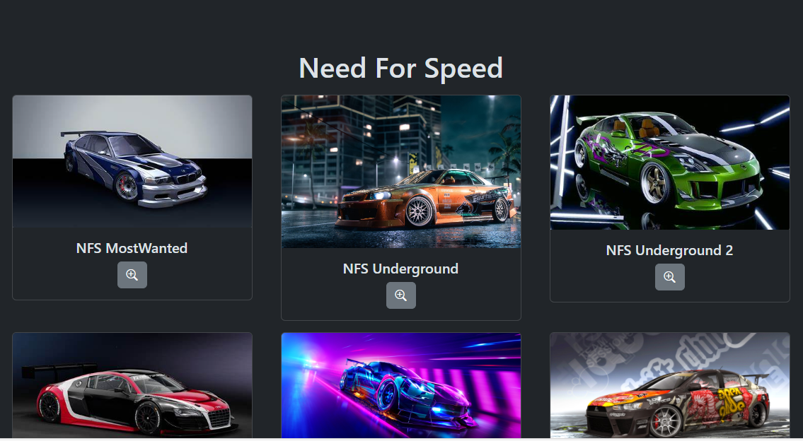

<h1 align="center"> Game Search </h1>

Programa exclusivo e gratuito.  
<a href="https://www.linkedin.com/in/andr%C3%A9-rolim-b8271b207/">Conheça mais sobre esse e outros projetos clicando aqui.</a>

  <a href="#-tecnologias">Tecnologias</a>&nbsp;&nbsp;&nbsp;|&nbsp;&nbsp;&nbsp;
  <a href="#-projeto">Projeto</a>&nbsp;&nbsp;&nbsp;|&nbsp;&nbsp;&nbsp;
  <a href="#-layout">Layout</a>&nbsp;&nbsp;&nbsp;|&nbsp;&nbsp;&nbsp;
  <a href="#memo-licença">Licença</a>

  

 

  

## 🚀 Tecnologias

Esse projeto foi desenvolvido com as seguintes tecnologias:

- HTML e CSS
- JavaScript
- Git e Github

## 💻 Projeto

O Game Search é uma ferramenta de links para buscar jogos online.

- [Acesse o projeto finalizado, online](https://andrerollim.github.io/Site-de-apresentacao-pessoal/)

## 🔖 Layout

Você pode visualizar o layout do projeto através [DESSE LINK](https://jornadadodev.com.br/cursos/front-end/javascript). É necessário ter conta no [JornadaDEV](https://jornadadodev.com.br/cursos/) para acessá-lo.

## :memo: Licença

Esse projeto está sob a licença MIT.

---

Feito com ♥ by André Rolim :wave: